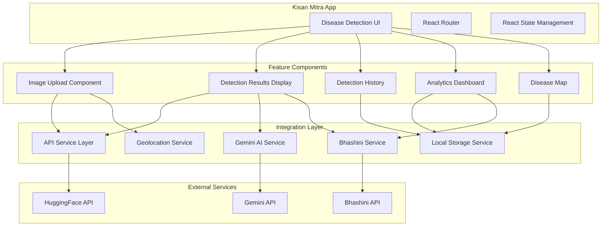

# Design Document: AI Image-Based Disease Detection

## Overview

This design document outlines the integration of AI-powered image-based disease detection into the Kisan Mitra application. The feature will leverage the existing YOLOv8 disease detection model from AgriSenseFlow via HuggingFace API, while seamlessly integrating with Kisan Mitra's existing infrastructure including Gemini AI chatbot, Bhashini translation service, and Shadcn/UI design system.

The implementation follows a component-based architecture with clear separation between UI, business logic, and data persistence layers. The design prioritizes user experience with offline-first capabilities, multilingual support, and progressive enhancement.

## Architecture

### High-Level Architecture



### Component Hierarchy

```
DiseaseDetectionPage
├── DiseaseDetectionTabs
│   ├── DetectTab
│   │   └── ImageUploadComponent
│   │       ├── DropzoneArea
│   │       ├── CameraCapture
│   │       └── ImagePreview
│   ├── ResultsTab
│   │   ├── DetectionResultCard
│   │   ├── DetectionImageWithBoundingBoxes
│   │   └── TreatmentRecommendationButton
│   ├── HistoryTab
│   │   ├── DetectionHistoryList
│   │   └── HistoryItemCard
│   └── AnalyticsTab
│       ├── AnalyticsSummary
│       ├── DiseaseFrequencyChart
│       ├── TemporalTrendChart
│       └── DiseaseLocationMap
└── IntegratedChatbot (reused from existing)
```

### Data Flow

1. **Image Upload Flow**:
   - User selects/captures image → ImageUploadComponent
   - Component validates file type and size
   - Image converted to FormData with location data
   - API service sends request to HuggingFace endpoint
   - Response parsed and validated against schema
   - DetectionResult created and stored in localStorage
   - UI updates to show results

2. **Treatment Recommendation Flow**:
   - User clicks "Get Treatment" button
   - Disease information extracted from DetectionResult
   - Context prepared with disease names, crop type, location
   - Gemini AI service called with organic farming prompt
   - Response translated to user's language via Bhashini
   - Chatbot interface displays recommendations

3. **Analytics Flow**:
   - Component loads detection history from localStorage
   - Data aggregated by disease type, time period, location
   - Charts and visualizations rendered
   - User interactions filter and update displays

## Components and Interfaces

### 1. ImageUploadComponent

**Purpose**: Handle image selection via drag-drop, file picker, or camera capture.

**Props**:
```typescript
interface ImageUploadProps {
  onImageSelect: (file: File) => void;
  isProcessing: boolean;
  maxSizeBytes?: number; // default: 10MB
  acceptedFormats?: string[]; // default: ['image/jpeg', 'image/png', 'image/webp']
  showCamera?: boolean; // default: true
}
```

**State**:
```typescript
interface ImageUploadState {
  preview: string | null;
  cameraActive: boolean;
  videoStream: MediaStream | null;
  error: string | null;
}
```

**Key Methods**:
- `handleDrop(files: File[]): void` - Process dropped files
- `handleFileSelect(event: ChangeEvent<HTMLInputElement>): void` - Process selected files
- `startCamera(): Promise<void>` - Initialize camera stream
- `capturePhoto(): void` - Capture image from video stream
- `stopCamera(): void` - Release camera resources
- `validateFile(file: File): boolean` - Check file type and size
- `clearImage(): void` - Reset component state

**Integration Points**:
- Uses `react-dropzone` for drag-drop functionality
- Uses `navigator.mediaDevices.getUserMedia` for camera access
- Integrates with Shadcn/UI Card and Button components

### 2. DetectionResultCard

**Purpose**: Display detection results with disease information and confidence scores.

**Props**:
```typescript
interface DetectionResultCardProps {
  result: DetectionResult;
  onRequestTreatment?: () => void;
  showLocation?: boolean;
}
```

**Rendering Logic**:
- Display total disease count
- Show timestamp and location (if available)
- List each prediction with:
  - Disease class name
  - Confidence percentage
  - Severity badge (High/Medium/Low based on confidence)
  - Progress bar visualization
- Show treatment recommendation prompt

**Styling**:
- Uses Shadcn/UI Card, Badge, Progress components
- Color-coded severity indicators:
  - High (≥80%): Red/Destructive
  - Medium (50-79%): Orange
  - Low (<50%): Gray/Secondary

### 3. DetectionImageWithBoundingBoxes

**Purpose**: Render image with SVG overlay showing disease detection bounding boxes.

**Props**:
```typescript
interface DetectionImageProps {
  imageUrl: string;
  predictions: Prediction[];
  highlightedIndex?: number | null;
  onPredictionHover?: (index: number | null) => void;
}
```

**Rendering Algorithm**:
```
1. Load image and get natural dimensions
2. Create SVG overlay with same viewBox as image dimensions
3. For each prediction:
   a. Extract bbox coordinates [x1, y1, x2, y2]
   b. Calculate width = x2 - x1, height = y2 - y1
   c. Draw rectangle at (x1, y1) with calculated dimensions
   d. Draw label background above rectangle
   e. Render disease name and confidence text
4. Apply distinct colors for different disease classes
5. Add hover effects for interactivity
```

**Color Palette**:
- Use distinct colors from a predefined palette for different diseases
- Ensure sufficient contrast against various image backgrounds
- Highlight hovered bounding box with increased opacity

### 4. DetectionHistoryList

**Purpose**: Display chronological list of past detections with filtering and deletion.

**Props**:
```typescript
interface DetectionHistoryProps {
  detections: DetectionResult[];
  onSelectDetection: (detection: DetectionResult) => void;
  onDeleteDetection: (id: string) => void;
  onClearAll: () => void;
}
```

**Features**:
- Sorted by timestamp (newest first)
- Thumbnail preview of each image
- Disease count and primary disease name
- Date/time display
- Location indicator (if available)
- Delete individual items
- Clear all history button

**State Management**:
- Loads from localStorage on mount
- Updates localStorage on delete operations
- Emits events for parent component updates

### 5. AnalyticsDashboard

**Purpose**: Visualize disease detection patterns and trends.

**Props**:
```typescript
interface AnalyticsDashboardProps {
  detections: DetectionResult[];
  dateRange?: { start: Date; end: Date };
  selectedField?: string;
}
```

**Visualizations**:

1. **Summary Cards**:
   - Total detections count
   - Unique diseases count
   - Most common disease
   - Average confidence score

2. **Disease Frequency Chart** (Bar Chart):
   - X-axis: Disease names
   - Y-axis: Occurrence count
   - Sorted by frequency descending

3. **Temporal Trend Chart** (Line Chart):
   - X-axis: Time periods (weeks/months)
   - Y-axis: Detection count
   - Multiple lines for different diseases

4. **Confidence Distribution** (Box Plot or Histogram):
   - Show confidence score distribution per disease type

**Data Aggregation**:
```typescript
interface AggregatedData {
  diseaseFrequency: Map<string, number>;
  temporalData: Array<{ period: string; counts: Map<string, number> }>;
  confidenceStats: Map<string, { min: number; max: number; avg: number }>;
}
```

### 6. DiseaseLocationMap

**Purpose**: Display geographic distribution of disease detections.

**Props**:
```typescript
interface DiseaseMapProps {
  detections: DetectionResult[];
  center?: { lat: number; lng: number };
  zoom?: number;
}
```

**Implementation**:
- Use Leaflet.js for map rendering (already in AgriSenseFlow)
- Cluster markers for nearby detections
- Color-code markers by disease type
- Show popup on marker click with:
  - Disease name(s)
  - Detection date
  - Confidence score
  - Link to full results

**Map Layers**:
- Base map: OpenStreetMap tiles
- Marker layer: Disease detection points
- Cluster layer: Grouped nearby markers

## Data Models

### DetectionResult

```typescript
interface DetectionResult {
  id: string; // Unique identifier (timestamp-based)
  imageUrl: string; // Data URL or blob URL
  imageName: string; // Original filename
  timestamp: number; // Unix timestamp in milliseconds
  location?: {
    lat: number;
    lng: number;
  };
  predictions: Prediction[];
  count: number; // Total number of diseases detected
}
```

### Prediction

```typescript
interface Prediction {
  class_name: string; // Disease name from model
  confidence: number; // 0-1 range
  bbox: [number, number, number, number]; // [x1, y1, x2, y2]
}
```

### DetectionHistory Storage Schema

```typescript
interface DetectionHistoryStorage {
  version: string; // Schema version for migrations
  detections: DetectionResult[];
  maxSize: number; // Maximum number of stored detections
}
```

**LocalStorage Key**: `kisanmitra_disease_detections`

**Storage Strategy**:
- Store up to 100 most recent detections
- When limit reached, remove oldest entries (FIFO)
- Compress image data URLs if storage quota exceeded
- Implement graceful degradation if localStorage unavailable

### API Request/Response Schemas

**Detection Request**:
```typescript
interface DetectionRequest {
  image: File; // Sent as FormData
  lat?: number; // Optional location
  lng?: number; // Optional location
}
```

**Detection Response** (from HuggingFace):
```typescript
interface DetectionResponse {
  predictions: Array<{
    class_name: string;
    confidence: number;
    bbox: number[]; // [x1, y1, x2, y2]
  }>;
  count: number;
}
```

**Treatment Request** (to Gemini):
```typescript
interface TreatmentRequest {
  diseases: string[]; // Array of disease names
  confidences: number[]; // Corresponding confidence scores
  cropType?: string;
  location?: { lat: number; lng: number };
  language: string; // Target language for response
}
```

## Correctness Properties

*A property is a characteristic or behavior that should hold true across all valid executions of a system—essentially, a formal statement about what the system should do. Properties serve as the bridge between human-readable specifications and machine-verifiable correctness guarantees.*

### Property 1: File Validation Consistency

*For any* file input to the ImageUploadComponent, if the file type is not in the accepted formats list OR the file size exceeds the maximum size limit, then the file should be rejected and an appropriate error message should be displayed.

**Validates: Requirements 1.3, 1.4, 1.9**

### Property 2: Image Upload Round Trip

*For any* valid image file that is successfully uploaded, the image preview displayed should be visually equivalent to the original file when rendered.

**Validates: Requirements 1.10**

### Property 3: Detection Result Schema Compliance

*For any* response received from the HuggingFace API, the parsed DetectionResult object should conform to the DetectionResult schema with all required fields present and correctly typed.

**Validates: Requirements 2.7, 2.8**

### Property 4: Bounding Box Coordinate Validity

*For any* prediction with bbox coordinates [x1, y1, x2, y2], the following invariants should hold: x1 < x2 AND y1 < y2 AND all coordinates are non-negative.

**Validates: Requirements 3.2**

### Property 5: Confidence Score Display Accuracy

*For any* prediction with confidence value c (where 0 ≤ c ≤ 1), the displayed percentage should equal Math.round(c * 1000) / 10, formatted with exactly one decimal place.

**Validates: Requirements 3.6**

### Property 6: Detection History Persistence Round Trip

*For any* DetectionResult object saved to localStorage, retrieving and deserializing it should produce an object that is deeply equal to the original (excluding non-serializable fields like blob URLs).

**Validates: Requirements 4.3, 4.4**

### Property 7: History Ordering Consistency

*For any* set of detection results in history, when displayed, they should be sorted by timestamp in descending order (newest first).

**Validates: Requirements 4.6**

### Property 8: Storage Quota Management

*For any* sequence of detection saves, when localStorage approaches capacity, the system should remove the oldest entries such that the total number of stored detections never exceeds the configured maximum.

**Validates: Requirements 4.5**

### Property 9: Translation Fallback Behavior

*For any* text that fails to translate via Bhashini service, the system should display the original English text without throwing errors or breaking the UI.

**Validates: Requirements 6.6, 6.8**

### Property 10: Disease Frequency Aggregation Accuracy

*For any* set of detection results, the disease frequency count for each disease type should equal the number of predictions across all detections where class_name matches that disease type.

**Validates: Requirements 7.2**

### Property 11: Map Marker Location Accuracy

*For any* detection result with location data, the corresponding map marker should be positioned at coordinates (lat, lng) matching the detection's location field.

**Validates: Requirements 7.4**

### Property 12: Retry Mechanism Exhaustion

*For any* API request that fails, the system should attempt exactly 3 retries with exponential backoff before displaying an error message to the user.

**Validates: Requirements 2.4, 2.5**

### Property 13: Camera Resource Cleanup

*For any* camera session that is started, when the session ends (via capture, cancel, or component unmount), all media stream tracks should be stopped and resources released.

**Validates: Requirements 1.7, 1.8**

### Property 14: Empty Detection Handling

*For any* API response where predictions array is empty, the system should display a "no diseases detected" message and should NOT attempt to render bounding boxes.

**Validates: Requirements 2.6, 3.7**

### Property 15: HTTPS Protocol Enforcement

*For any* API request to external services (HuggingFace, Gemini, Bhashini), the request URL should use HTTPS protocol.

**Validates: Requirements 10.2**

## Error Handling

### Error Categories

1. **User Input Errors**:
   - Invalid file type
   - File size exceeds limit
   - No file selected
   - Camera permission denied

2. **Network Errors**:
   - API request timeout
   - Network connectivity issues
   - API rate limiting
   - Server errors (5xx)

3. **Data Errors**:
   - Invalid API response format
   - Schema validation failures
   - Corrupted localStorage data
   - Missing required fields

4. **Resource Errors**:
   - localStorage quota exceeded
   - Camera not available
   - Geolocation unavailable
   - Memory constraints

### Error Handling Strategies

**User Input Errors**:
```typescript
try {
  validateFile(file);
} catch (error) {
  if (error instanceof FileSizeError) {
    showToast({
      title: "File Too Large",
      description: `Maximum size is ${maxSizeMB}MB`,
      variant: "destructive"
    });
  } else if (error instanceof FileTypeError) {
    showToast({
      title: "Invalid File Type",
      description: "Please upload JPG, PNG, or WEBP images",
      variant: "destructive"
    });
  }
  return;
}
```

**Network Errors with Retry**:
```typescript
async function detectWithRetry(
  file: File,
  maxRetries: number = 3
): Promise<DetectionResult> {
  let lastError: Error;
  
  for (let attempt = 0; attempt < maxRetries; attempt++) {
    try {
      return await callDetectionAPI(file);
    } catch (error) {
      lastError = error;
      if (attempt < maxRetries - 1) {
        const delay = Math.pow(2, attempt) * 1000; // Exponential backoff
        await sleep(delay);
      }
    }
  }
  
  throw new Error(`Detection failed after ${maxRetries} attempts: ${lastError.message}`);
}
```

**Data Errors**:
```typescript
function parseDetectionResponse(response: unknown): DetectionResult {
  try {
    const validated = detectionResultSchema.parse(response);
    return validated;
  } catch (error) {
    if (error instanceof ZodError) {
      console.error("Schema validation failed:", error.errors);
      throw new Error("Invalid response format from detection service");
    }
    throw error;
  }
}
```

**Resource Errors**:
```typescript
function saveDetection(detection: DetectionResult): void {
  try {
    const history = getDetectionHistory();
    history.unshift(detection);
    
    // Enforce maximum size
    if (history.length > MAX_HISTORY_SIZE) {
      history.splice(MAX_HISTORY_SIZE);
    }
    
    localStorage.setItem(STORAGE_KEY, JSON.stringify(history));
  } catch (error) {
    if (error.name === 'QuotaExceededError') {
      // Remove oldest entries and retry
      const history = getDetectionHistory();
      history.splice(Math.floor(MAX_HISTORY_SIZE / 2));
      localStorage.setItem(STORAGE_KEY, JSON.stringify(history));
      
      // Retry save
      saveDetection(detection);
    } else {
      console.error("Failed to save detection:", error);
      showToast({
        title: "Storage Error",
        description: "Unable to save detection history",
        variant: "destructive"
      });
    }
  }
}
```

### Error Messages

All error messages should be:
- User-friendly and non-technical
- Actionable (suggest next steps)
- Translatable via Bhashini
- Consistent with Kisan Mitra's tone

**Examples**:
- ❌ "API request failed with status 500"
- ✅ "Unable to analyze image. Please check your internet connection and try again."

- ❌ "localStorage.setItem threw QuotaExceededError"
- ✅ "Storage is full. Some older detections were removed to make space."

## Testing Strategy

### Dual Testing Approach

The testing strategy employs both unit tests and property-based tests to ensure comprehensive coverage:

- **Unit Tests**: Validate specific examples, edge cases, and integration points
- **Property Tests**: Verify universal properties across randomized inputs

Both approaches are complementary and necessary for robust validation.

### Unit Testing

**Focus Areas**:
1. Component rendering with specific props
2. User interaction handlers (clicks, drags, inputs)
3. API integration with mocked responses
4. localStorage operations with specific data
5. Error boundary behavior
6. Translation integration
7. Geolocation integration

**Example Unit Tests**:
```typescript
describe('ImageUploadComponent', () => {
  it('should reject files larger than 10MB', () => {
    const largeFile = createMockFile(11 * 1024 * 1024);
    const onSelect = jest.fn();
    render(<ImageUpload onImageSelect={onSelect} />);
    
    // Simulate file drop
    fireEvent.drop(screen.getByTestId('dropzone'), {
      dataTransfer: { files: [largeFile] }
    });
    
    expect(onSelect).not.toHaveBeenCalled();
    expect(screen.getByText(/file too large/i)).toBeInTheDocument();
  });
  
  it('should display camera button when showCamera is true', () => {
    render(<ImageUpload onImageSelect={jest.fn()} showCamera={true} />);
    expect(screen.getByText(/use camera/i)).toBeInTheDocument();
  });
});

describe('DetectionResultCard', () => {
  it('should display high confidence badge for 80%+ confidence', () => {
    const result = createMockDetection({ confidence: 0.85 });
    render(<DetectionResultCard result={result} />);
    expect(screen.getByText(/high confidence/i)).toBeInTheDocument();
  });
});
```

### Property-Based Testing

**Configuration**:
- Use `fast-check` library for TypeScript/JavaScript
- Minimum 100 iterations per property test
- Each test tagged with feature name and property number

**Property Test Examples**:

```typescript
import fc from 'fast-check';

// Feature: ai-image-disease-detection, Property 1: File Validation Consistency
describe('Property 1: File Validation Consistency', () => {
  it('should reject all invalid files', () => {
    fc.assert(
      fc.property(
        fc.record({
          size: fc.integer({ min: 0, max: 20 * 1024 * 1024 }),
          type: fc.oneof(
            fc.constant('image/jpeg'),
            fc.constant('image/png'),
            fc.constant('image/webp'),
            fc.constant('application/pdf'),
            fc.constant('text/plain')
          )
        }),
        (fileProps) => {
          const file = createMockFile(fileProps.size, fileProps.type);
          const isValid = validateFile(file, {
            maxSize: 10 * 1024 * 1024,
            acceptedTypes: ['image/jpeg', 'image/png', 'image/webp']
          });
          
          const shouldBeValid = 
            fileProps.size <= 10 * 1024 * 1024 &&
            ['image/jpeg', 'image/png', 'image/webp'].includes(fileProps.type);
          
          return isValid === shouldBeValid;
        }
      ),
      { numRuns: 100 }
    );
  });
});

// Feature: ai-image-disease-detection, Property 4: Bounding Box Coordinate Validity
describe('Property 4: Bounding Box Coordinate Validity', () => {
  it('should maintain bbox coordinate invariants', () => {
    fc.assert(
      fc.property(
        fc.array(
          fc.record({
            class_name: fc.string({ minLength: 1 }),
            confidence: fc.float({ min: 0, max: 1 }),
            bbox: fc.tuple(
              fc.float({ min: 0, max: 1000 }),
              fc.float({ min: 0, max: 1000 }),
              fc.float({ min: 0, max: 1000 }),
              fc.float({ min: 0, max: 1000 })
            )
          })
        ),
        (predictions) => {
          const result = createDetectionResult({ predictions });
          
          return result.predictions.every(pred => {
            const [x1, y1, x2, y2] = pred.bbox;
            return x1 < x2 && y1 < y2 && x1 >= 0 && y1 >= 0;
          });
        }
      ),
      { numRuns: 100 }
    );
  });
});

// Feature: ai-image-disease-detection, Property 6: Detection History Persistence Round Trip
describe('Property 6: Detection History Persistence Round Trip', () => {
  it('should preserve detection data through save/load cycle', () => {
    fc.assert(
      fc.property(
        fc.array(
          fc.record({
            id: fc.string(),
            imageName: fc.string(),
            timestamp: fc.integer({ min: 0 }),
            predictions: fc.array(
              fc.record({
                class_name: fc.string(),
                confidence: fc.float({ min: 0, max: 1 }),
                bbox: fc.tuple(fc.float(), fc.float(), fc.float(), fc.float())
              })
            ),
            count: fc.integer({ min: 0 })
          }),
          { maxLength: 10 }
        ),
        (detections) => {
          // Save to localStorage
          saveDetectionHistory(detections);
          
          // Load from localStorage
          const loaded = getDetectionHistory();
          
          // Compare (excluding non-serializable fields)
          return detections.every((original, index) => {
            const restored = loaded[index];
            return (
              original.id === restored.id &&
              original.imageName === restored.imageName &&
              original.timestamp === restored.timestamp &&
              original.count === restored.count &&
              JSON.stringify(original.predictions) === JSON.stringify(restored.predictions)
            );
          });
        }
      ),
      { numRuns: 100 }
    );
  });
});

// Feature: ai-image-disease-detection, Property 7: History Ordering Consistency
describe('Property 7: History Ordering Consistency', () => {
  it('should always display history in descending timestamp order', () => {
    fc.assert(
      fc.property(
        fc.array(
          fc.record({
            id: fc.string(),
            timestamp: fc.integer({ min: 0, max: Date.now() })
          }),
          { minLength: 2, maxLength: 20 }
        ),
        (detections) => {
          const sorted = sortDetectionHistory(detections);
          
          // Check that each timestamp is >= the next
          for (let i = 0; i < sorted.length - 1; i++) {
            if (sorted[i].timestamp < sorted[i + 1].timestamp) {
              return false;
            }
          }
          return true;
        }
      ),
      { numRuns: 100 }
    );
  });
});

// Feature: ai-image-disease-detection, Property 10: Disease Frequency Aggregation Accuracy
describe('Property 10: Disease Frequency Aggregation Accuracy', () => {
  it('should accurately count disease occurrences', () => {
    fc.assert(
      fc.property(
        fc.array(
          fc.record({
            predictions: fc.array(
              fc.record({
                class_name: fc.oneof(
                  fc.constant('Leaf Blight'),
                  fc.constant('Rust'),
                  fc.constant('Powdery Mildew')
                ),
                confidence: fc.float({ min: 0, max: 1 }),
                bbox: fc.tuple(fc.float(), fc.float(), fc.float(), fc.float())
              })
            )
          })
        ),
        (detections) => {
          const aggregated = aggregateDiseaseFrequency(detections);
          
          // Manually count occurrences
          const manualCount = new Map<string, number>();
          detections.forEach(detection => {
            detection.predictions.forEach(pred => {
              manualCount.set(
                pred.class_name,
                (manualCount.get(pred.class_name) || 0) + 1
              );
            });
          });
          
          // Compare aggregated with manual count
          return Array.from(manualCount.entries()).every(([disease, count]) => {
            return aggregated.get(disease) === count;
          });
        }
      ),
      { numRuns: 100 }
    );
  });
});
```

### Integration Testing

**Focus Areas**:
1. End-to-end detection flow (upload → API → results → storage)
2. Chatbot integration with disease context
3. Translation service integration
4. Navigation between tabs
5. History management operations

**Example Integration Test**:
```typescript
describe('Disease Detection Flow', () => {
  it('should complete full detection workflow', async () => {
    // Mock API responses
    mockHuggingFaceAPI.mockResolvedValue({
      predictions: [
        { class_name: 'Leaf Blight', confidence: 0.85, bbox: [10, 10, 100, 100] }
      ],
      count: 1
    });
    
    render(<DiseaseDetectionPage />);
    
    // Upload image
    const file = createMockImageFile();
    const input = screen.getByLabelText(/upload/i);
    fireEvent.change(input, { target: { files: [file] } });
    
    // Wait for processing
    await waitFor(() => {
      expect(screen.getByText(/detection complete/i)).toBeInTheDocument();
    });
    
    // Verify results displayed
    expect(screen.getByText('Leaf Blight')).toBeInTheDocument();
    expect(screen.getByText('85.0%')).toBeInTheDocument();
    
    // Verify saved to history
    const history = getDetectionHistory();
    expect(history).toHaveLength(1);
    expect(history[0].predictions[0].class_name).toBe('Leaf Blight');
  });
});
```

### Test Coverage Goals

- **Unit Tests**: 80%+ code coverage
- **Property Tests**: All correctness properties implemented
- **Integration Tests**: All major user flows covered
- **E2E Tests**: Critical paths (upload → detect → view results)

### Continuous Testing

- Run unit tests on every commit
- Run property tests on pull requests
- Run integration tests before deployment
- Monitor test execution time and optimize slow tests
